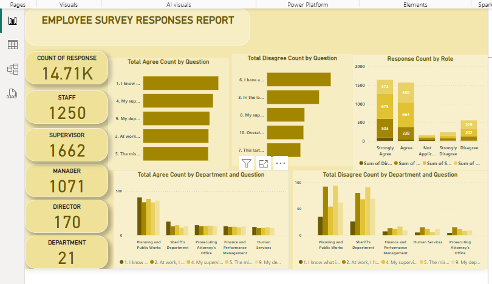
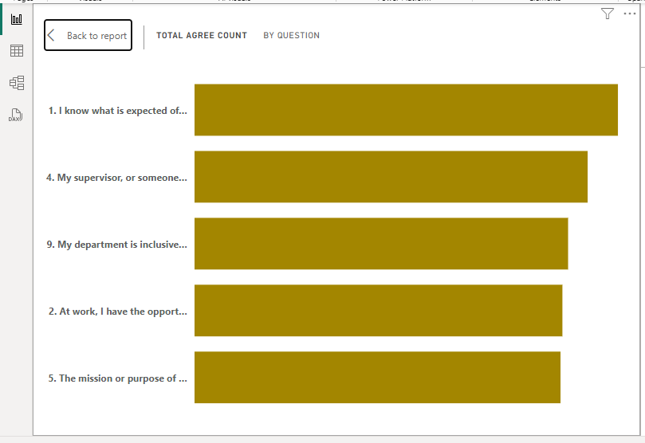
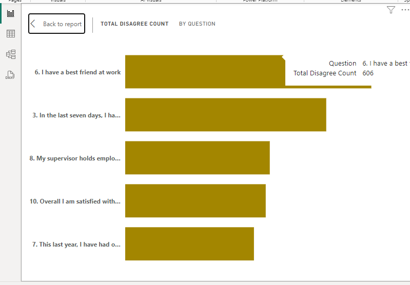
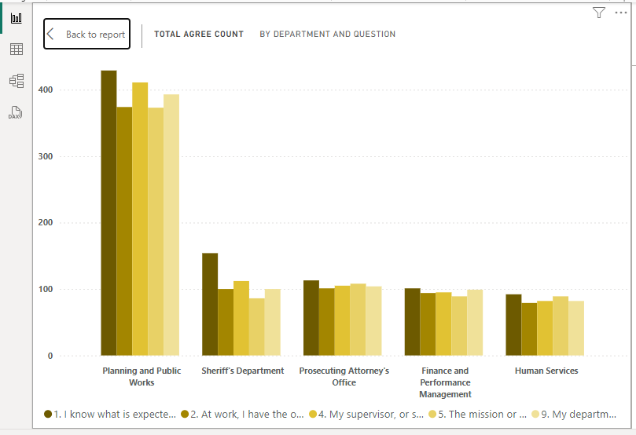
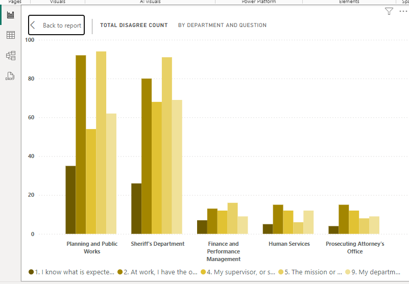
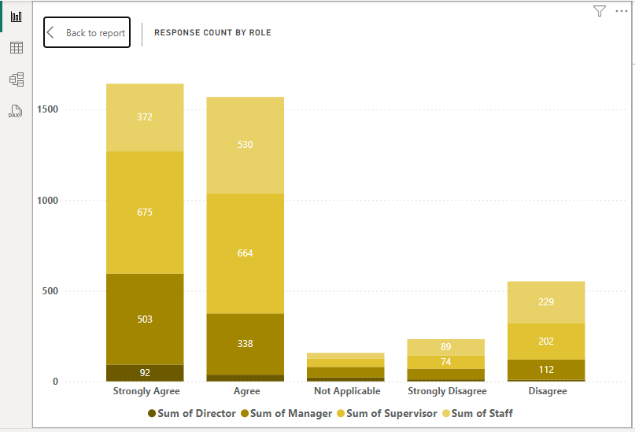

# Employee-Survey-Response

## Introduction
  This is a report of an employee engagement survey conducted by Pierce County WA and completed voluntarily by government employees. The report presents  findings from employee survey aimed at understanding the level of satisfaction and engagement within the organization. The survey focused on various aspects of the work environment, including expectations, opportunities, recognition, supervision, organizational mission, personal relationships, growth, accountability, and overall job satisfaction.

## Problem Statement
1. Which survey questions did respondents agree with or disagree with most?
2. Do you see any patterns or trends by department or role?
3. As an employer, what steps might you take to improve employee satisfaction based on the survey results?

## Data Analysis
The responses were analyzed using Power BI to create interactive and insightful visualizations. Each question was rated on a Likert scale ranging from "Strongly Disagree" to "Strongly Agree." The analysis included calculating average scores, distribution of responses, and identifying key trends and areas for improvement.
## Visualization

### Dashboard Overview 

 

The Power BI dashboard created for this analysis includes the following key visualizations:
- The total agree and disagree count by the questions 
- The total agree and disagree count by department
- The response count by role

## Analysis

  

   
   

  The above images indicate that majority of employees agree that they know what is expected of them at work and a smaller proportion of employees report having a best friend at work, indicating potential for improved social connectivity.

  
   
   
   

  Across all departments, employees generally understand what is expected of them and the enjoy their jobs. The Planning and public works department stands out with a high agreement.This may be due to them being of a larger population.

   

## Conclusion
   The employee survey provides valuable insights into the current state of employee satisfaction and engagement within the organization. While there are many strengths, such as clear expectations and being work oriented, there are also areas that require attention, particularly in social connectivity among employees.

### Recommendation
    Employers should create outdoors fun activity to enable employees connect and bond with each other.

 
 

 
  

  
     

  

